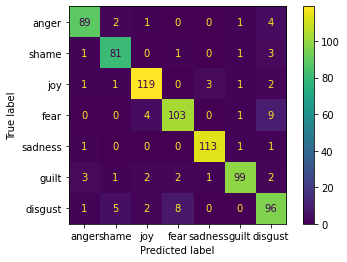

# Emotion Detection Baseline

## Labels for the dataset are:
* All classes have equal data points therefore no need to augment data.

| Label | Description | Number of Samples |
| :--- | :--- | :--- |
| 0 | Anger | 864 |
| 1 | Disgust | 874 |
| 2 | Fear | 882 |
| 3 | Shame | 888   |
| 4 | Sadness | 892 |
| 5 | Guilt | 894 |

> Dataset used -  [ISEAR Dataset](https://raw.githubusercontent.com/bhargav1000/textclassifier/master/original_dataset/ISEAR/DATA.csv)

> model-checkpoint : [emotion-english-distilroberta-base](https://huggingface.co/j-hartmann/emotion-english-distilroberta-base)

## Results Confusion metrics:
<!-- display image url -->

## metrics on test set:
* ### precision: 0.9140753526444316
* ### recall: 0.9138843997842093
* ### f1: 0.9137515613065151

### Further improvements to be done in the future.